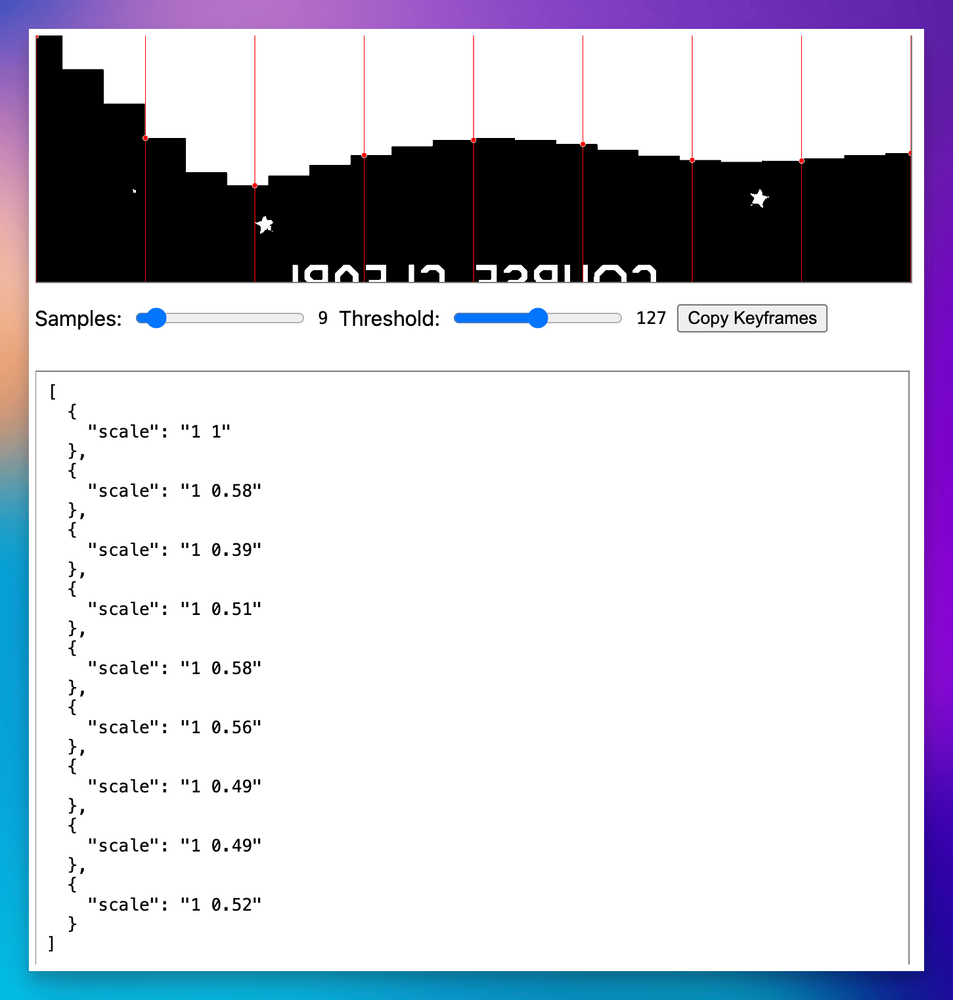
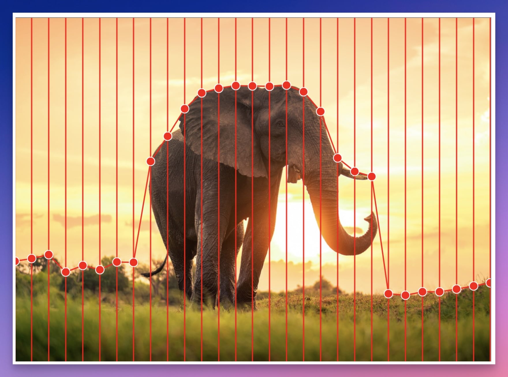

# Keyframe Generator

A quick-and dirty web app to paste an image into a canvas and generate JavaScript animation keyframes that match the top curve of the image. This works best with black and white images, and was specifically created to match the curve of a graph. This is opposed to hand-tuning keyframes.

This is not very flexible, and is probably not helpful to most as-is, but might serve as a simple starting point for other quick tools that analyze an image.

## Interface with a graph

<figure>
	
	</figcaption>
		Matching a curve over time.
	<figcaption>
</figure>

## Elephant

<figure>
	
	<figcaption>
		Less useful for photos, but adjust the threshold to try.
	</figcaption>
</figure>
